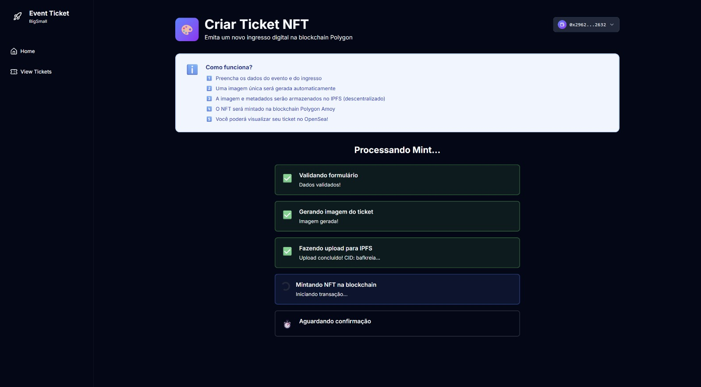
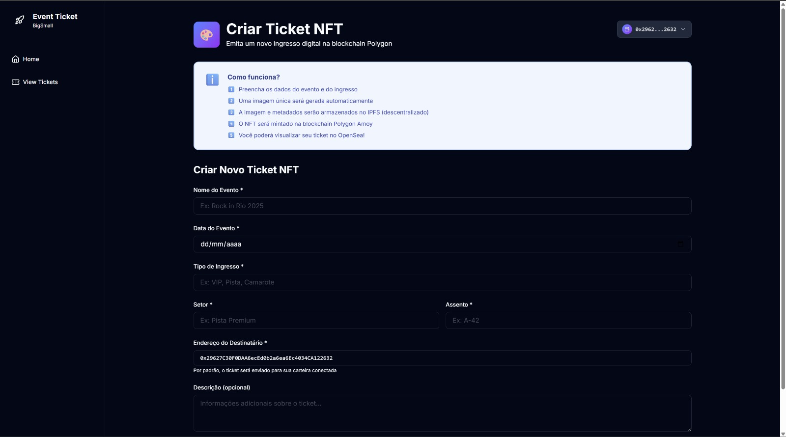
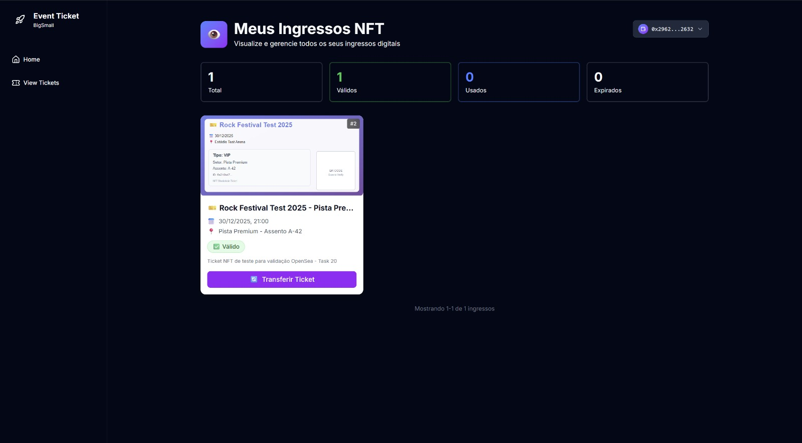

# Event Ticket NFT - Sistema de Ingressos Blockchain

Sistema completo de emissão, validação e gestão de ingressos digitais baseados em NFTs (ERC-721) na blockchain Polygon.

## Visão Geral

Este projeto implementa um sistema descentralizado de tickets para eventos, onde cada ingresso é um NFT único e verificável na blockchain. O sistema garante autenticidade, rastreabilidade e previne fraudes através da tecnologia blockchain.

### Principais Funcionalidades

- Emissão de ingressos como NFTs ERC-721
- Validação de ingressos via QR Code
- Check-in na blockchain com registro imutável
- Metadados armazenados no IPFS (descentralizado)
- Interface web para gestão de eventos e validação
- Integração com carteiras Web3 (MetaMask, WalletConnect)

## Stack Tecnológica

### Blockchain & Smart Contracts

- **Solidity 0.8.20** - Linguagem para smart contracts
- **Hardhat 3.0.7** - Framework de desenvolvimento Ethereum
- **OpenZeppelin Contracts 5.4.0** - Biblioteca padrão de contratos seguros
- **Ethers.js** - Biblioteca de interação com blockchain

### Frontend

- **React 19.1** - Framework JavaScript
- **Vite 7.1** - Build tool e dev server
- **TypeScript 5.9** - Tipagem estática
- **TailwindCSS 4.1** - Framework CSS utility-first
- **Wagmi 2.18** - React hooks para Ethereum
- **RainbowKit 2.2** - UI para conexão de carteiras
- **React Router 7.9** - Roteamento SPA
- **React Hook Form 7.65** - Gerenciamento de formulários
- **Zod 4.1** - Validação de schemas

### Infraestrutura & Armazenamento

- **Polygon Amoy Testnet** - Rede blockchain de testes (Chain ID: 80002)
- **Alchemy RPC** - Provedor de nós blockchain
- **Pinata** - Serviço de pinning IPFS para metadados
- **IPFS** - Armazenamento descentralizado

### Utilitários

- **QRCode** - Geração de QR codes
- **UUID** - Geração de identificadores únicos
- **date-fns** - Manipulação de datas

## Arquitetura do Sistema

### Fluxo de Emissão de Ingressos

```
1. Organizador cria evento no sistema
   ↓
2. Sistema gera metadados do ingresso (JSON)
   ↓
3. Upload dos metadados para IPFS via Pinata
   ↓
4. Smart contract minta NFT com URI do IPFS
   ↓
5. NFT transferido para carteira do comprador
   ↓
6. Sistema gera QR Code com tokenId
```

### Fluxo de Validação de Ingressos

```
1. Validador escaneia QR Code do ingresso
   ↓
2. Frontend extrai tokenId do QR Code
   ↓
3. Consulta smart contract para verificar:
   - Ingresso existe
   - Data do evento ainda é válida
   - Ingresso não foi usado (checkedIn = false)
   ↓
4. Se válido, executa checkIn() no smart contract
   ↓
5. Blockchain registra check-in de forma imutável
```

### Estrutura do Smart Contract

**EventTicket.sol** - Contrato principal ERC-721

```solidity
struct Ticket {
    uint256 eventId;      // ID do evento
    string seat;          // Assento
    string sector;        // Setor
    uint256 eventDate;    // Data do evento (timestamp)
    bool checkedIn;       // Status de check-in
}

// Principais funções:
- mintTicket()           // Emite novo ingresso
- checkIn()              // Registra entrada do participante
- getTicketInfo()        // Consulta dados do ingresso
- isTicketValid()        // Verifica validade
- isTicketCheckedIn()    // Verifica se já fez check-in
```

## Pré-requisitos

Antes de iniciar, certifique-se de ter instalado:

- **Node.js 18+** - [Download](https://nodejs.org/)
- **npm** ou **yarn** - Gerenciador de pacotes
- **Git** - Controle de versão
- **MetaMask** - Extensão de navegador para carteira Web3

## Instalação e Configuração

### 1. Clone o Repositório

```bash
git clone <url-do-repositorio>
cd poc-ticket-blockchain
```

### 2. Instale as Dependências

**Backend (Smart Contracts):**

```bash
npm install
```

**Frontend:**

```bash
cd frontend
npm install
cd ..
```

### 3. Configure Variáveis de Ambiente

Copie o arquivo de exemplo e configure suas credenciais:

```bash
cp .env.example .env
```

Edite o arquivo `.env` com suas configurações:

```bash
# ======================================
# POLYGON AMOY RPC CONFIGURATION
# ======================================
# Opção 1 (RECOMENDADO): Alchemy
# Crie conta em https://alchemy.com
ALCHEMY_API_KEY=your_alchemy_api_key

# Opção 2 (FALLBACK): RPC público
POLYGON_AMOY_RPC_URL=https://rpc-amoy.polygon.technology

# Chave privada da carteira (NUNCA usar chave real em produção!)
# Crie uma carteira de teste no MetaMask
PRIVATE_KEY=0xYOUR_PRIVATE_KEY

# PolygonScan API Key (para verificação de contratos)
POLYGONSCAN_API_KEY=your_polygonscan_api_key

# ======================================
# IPFS STORAGE - PINATA
# ======================================
# Crie conta em https://pinata.cloud
# Dashboard > API Keys > New Key
PINATA_JWT=your_pinata_jwt_here
```

#### Como obter as credenciais:

**Alchemy API Key:**
1. Acesse [alchemy.com](https://alchemy.com)
2. Crie uma conta gratuita
3. Crie um novo app para "Polygon Amoy"
4. Copie a API Key

**Pinata JWT:**
1. Acesse [pinata.cloud](https://pinata.cloud)
2. Crie uma conta gratuita (1GB storage)
3. Vá para "API Keys" no dashboard
4. Clique em "New Key"
5. Dê permissões de `pinFileToIPFS` e `pinJSONToIPFS`
6. Copie o JWT (começa com "eyJ...")

**Private Key (carteira de teste):**
1. Abra MetaMask
2. Crie uma nova conta para testes
3. Clique nos 3 pontos > Account Details > Export Private Key
4. Cole no `.env` (NUNCA use carteira real!)

**Polygon Amoy Testnet POL:**
1. Acesse [faucet.polygon.technology](https://faucet.polygon.technology)
2. Conecte sua carteira MetaMask
3. Solicite POL tokens gratuitos para testes

## Execução do Projeto

### Ambiente de Desenvolvimento Local

#### 1. Compile os Smart Contracts

```bash
npm run compile
```

#### 2. Execute os Testes

```bash
# Testes unitários
npm test

# Testes com cobertura
npm run test:coverage

# Testes com relatório de gas
npm run test:gas

# Teste de metadados
npm run test:metadata

# Teste de integração IPFS
npm run test:ipfs

# Teste de conexão RPC
npm run test:rpc
```

#### 3. Deploy Local (Hardhat Network)

```bash
# Inicia node local e faz deploy
npm run deploy:local
```

Este comando irá:
- Iniciar uma blockchain local (Hardhat)
- Fazer deploy do contrato EventTicket
- Exibir o endereço do contrato
- Salvar deployment em `deployments/local.json`

#### 4. Inicie o Frontend

Em outro terminal:

```bash
cd frontend
npm run dev
```

Acesse: `http://localhost:5173`

### Ambiente de Testnet (Polygon Amoy)

#### 1. Certifique-se de ter POL na carteira

Use o faucet para obter tokens de teste: [faucet.polygon.technology](https://faucet.polygon.technology)

#### 2. Faça o Deploy na Testnet

```bash
npm run deploy:amoy
```

Este comando irá:
- Conectar na Polygon Amoy via Alchemy
- Fazer deploy usando sua private key do `.env`
- Exibir endereço do contrato e transaction hash
- Salvar deployment em `deployments/amoy.json`

#### 3. Verifique o Contrato no PolygonScan (Opcional)

```bash
npm run verify:amoy <CONTRACT_ADDRESS>
```

## Scripts Disponíveis

### Backend (Root)

```bash
# Compilação e Testes
npm test                    # Testes unitários
npm run test:coverage       # Cobertura de testes
npm run test:gas           # Relatório de gas usage
npm run test:metadata      # Testa geração de metadados
npm run test:metadata:all  # Todos os testes de metadados
npm run test:ipfs          # Testa integração com Pinata
npm run test:rpc           # Testa conexão RPC

# Deploy
npm run deploy:local       # Deploy em rede local
npm run deploy:amoy        # Deploy na Polygon Amoy testnet
npm run verify:amoy        # Verifica contrato no PolygonScan

# Utilitários
npm run mint:ipfs          # Minta ticket com metadados no IPFS
npm run generate:tickets   # Gera exemplos de tickets SVG
```

### Frontend

```bash
npm run dev         # Inicia servidor de desenvolvimento
npm run build       # Build para produção
npm run preview     # Preview do build de produção
npm run lint        # Executa linter
```

## Estrutura do Projeto

```
poc-ticket-blockchain/
├── contracts/                # Smart Contracts Solidity
│   ├── EventTicket.sol      # Contrato principal ERC-721
│   └── EventTicket.t.sol    # Contrato de testes
│
├── scripts/                  # Scripts de deploy e utilitários
│   ├── deploy.ts            # Script de deploy
│   ├── mint-ticket-with-ipfs.ts
│   ├── generate-ticket-examples.ts
│   ├── test-metadata.ts
│   ├── test-pinata-integration.ts
│   └── test-rpc-connection.ts
│
├── test/                     # Testes unitários
│   ├── EventTicket.test.ts  # Testes do contrato
│   └── metadata/            # Testes de metadados
│
├── utils/                    # Utilitários e helpers
│   ├── metadata/            # Geradores de metadados
│   ├── ipfs.ts              # Cliente Pinata IPFS
│   └── ticket-generator.ts  # Gerador de SVG tickets
│
├── frontend/                 # Aplicação React
│   ├── src/
│   │   ├── components/      # Componentes React
│   │   ├── hooks/           # Custom hooks
│   │   ├── lib/             # Configurações e utils
│   │   ├── pages/           # Páginas da aplicação
│   │   └── App.tsx          # Componente raiz
│   ├── public/              # Arquivos estáticos
│   └── package.json
│
├── assets/                   # Assets gerados
│   ├── metadata/            # Arquivos JSON de metadados
│   └── tickets/             # Imagens SVG de tickets
│
├── deployments/              # Registros de deployments
│   ├── local.json           # Deploy local
│   └── amoy.json            # Deploy Amoy testnet
│
├── types/                    # Tipos TypeScript gerados
├── hardhat.config.ts        # Configuração Hardhat
├── package.json             # Dependências backend
├── .env.example             # Exemplo de variáveis de ambiente
└── README.md                # Este arquivo
```

## Fluxos Importantes da Aplicação

### 1. Criação e Emissão de Ingresso

**Responsável:** Organizador do Evento

1. Organizador acessa frontend e conecta carteira Web3
2. Preenche formulário com dados do evento:
   - Nome do evento
   - Data e hora
   - Local
   - Setor e assento
3. Sistema gera metadados NFT compatível com padrão ERC-721:
```json
{
  "name": "Event Ticket #1",
  "description": "Ticket for Event Name",
  "image": "ipfs://QmHash/ticket.svg",
  "attributes": [
    {"trait_type": "Event", "value": "Event Name"},
    {"trait_type": "Date", "value": "2025-12-31"},
    {"trait_type": "Seat", "value": "A15"},
    {"trait_type": "Sector", "value": "VIP"}
  ]
}
```
4. Upload de metadados para IPFS via Pinata
5. Transação enviada ao smart contract `mintTicket()`
6. NFT mintado e transferido para carteira do comprador
7. Sistema gera QR Code com `tokenId` do NFT
8. QR Code pode ser impresso ou enviado digitalmente

### 2. Validação na Entrada do Evento

**Responsável:** Equipe de Validação

1. Validador abre app de validação no tablet/celular
2. Escaneia QR Code do ingresso do participante
3. App extrai `tokenId` do QR Code
4. Consulta blockchain via `getTicketInfo(tokenId)`:
   - Verifica se NFT existe
   - Checa se data do evento é válida
   - Verifica se já não foi usado (`checkedIn = false`)
5. Se válido:
   - Exibe dados do ingresso (nome, setor, assento)
   - Validador confirma entrada
   - App executa `checkIn(tokenId)` no smart contract
   - Blockchain registra timestamp de entrada
6. Se inválido:
   - Exibe motivo (expirado, já usado, não existe)
   - Entrada negada

### 3. Consulta de Histórico

**Responsável:** Organizador/Auditoria

1. Acessa dashboard de eventos
2. Seleciona evento específico
3. Sistema consulta blockchain para todos tokens do evento
4. Exibe:
   - Total de ingressos emitidos
   - Quantidade de check-ins realizados
   - Lista de participantes (se permitido)
   - Horários de entrada
5. Dados são imutáveis e auditáveis

## Padrões e Segurança

### Smart Contract

- **ERC-721 Standard:** Compatível com carteiras e marketplaces
- **Ownable:** Apenas owner pode mintar ingressos
- **ReentrancyGuard:** Proteção contra ataques de reentrância
- **Validações:** Todas entradas validadas com `require()`
- **Events:** Emissão de eventos para rastreabilidade
- **Gas Optimization:** Código otimizado para reduzir custos

### Frontend

- **Type Safety:** TypeScript em todo código
- **Form Validation:** Zod schemas para validação
- **Error Handling:** Try/catch e error boundaries
- **Wallet Integration:** Suporte múltiplas carteiras via RainbowKit
- **Responsive Design:** Interface adaptável para mobile/desktop

## Troubleshooting

### Problemas Comuns

**1. Erro ao conectar na blockchain**
```
Error: could not detect network
```
Solução: Verifique se `ALCHEMY_API_KEY` está configurada no `.env`

**2. Erro de gas insuficiente**
```
Error: insufficient funds for gas
```
Solução: Obtenha POL tokens no faucet: [faucet.polygon.technology](https://faucet.polygon.technology)

**3. Erro ao fazer upload no IPFS**
```
Error: Pinata authentication failed
```
Solução: Verifique se `PINATA_JWT` está correto no `.env`. O token deve começar com "eyJ..."

**4. MetaMask não conecta**
- Certifique-se de ter MetaMask instalado
- Adicione a rede Polygon Amoy manualmente:
  - Network Name: Polygon Amoy
  - RPC URL: https://rpc-amoy.polygon.technology
  - Chain ID: 80002
  - Currency Symbol: POL
  - Block Explorer: https://amoy.polygonscan.com

**5. Testes falhando**
```bash
# Limpe cache e recompile
rm -rf cache artifacts
npx hardhat compile
npm test
```

## Screenshots

### Conectar Carteira Web3


*Interface para conexão com carteiras Web3 (MetaMask, WalletConnect, etc.)*

### Criar Ingresso


*Formulário para criação e emissão de novos ingressos NFT*

### Consultar Ingressos


*Tela de consulta e visualização de ingressos emitidos*


## Próximos Passos e Melhorias

- [ ] Implementar marketplace de revenda de ingressos
- [ ] Adicionar suporte para ingressos com royalties
- [ ] Sistema de refund automático
- [ ] Integração com gateway de pagamento
- [ ] App mobile nativo (React Native)
- [ ] Notificações push para eventos
- [ ] Dashboard de analytics para organizadores
- [ ] Suporte multi-idiomas
- [ ] Modo offline para validação (sync posterior)

## Licença

MIT License - Veja [LICENSE](LICENSE) para mais detalhes.

## Autor

**João Alexandre**

## Suporte

Para dúvidas ou problemas, abra uma issue no repositório ou entre em contato.
